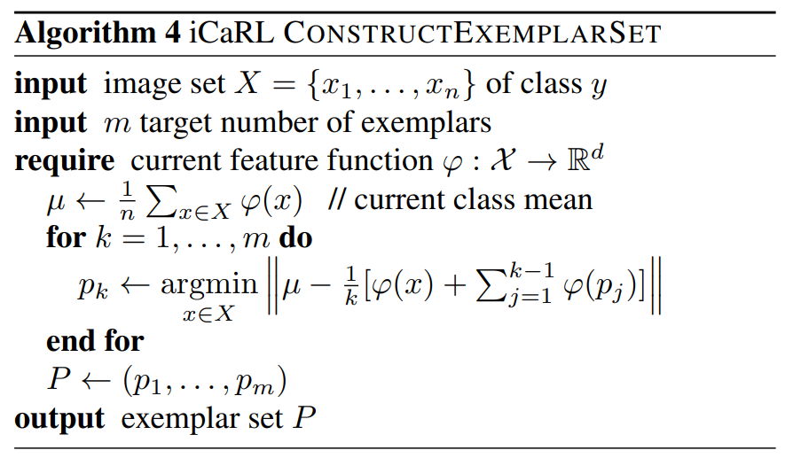
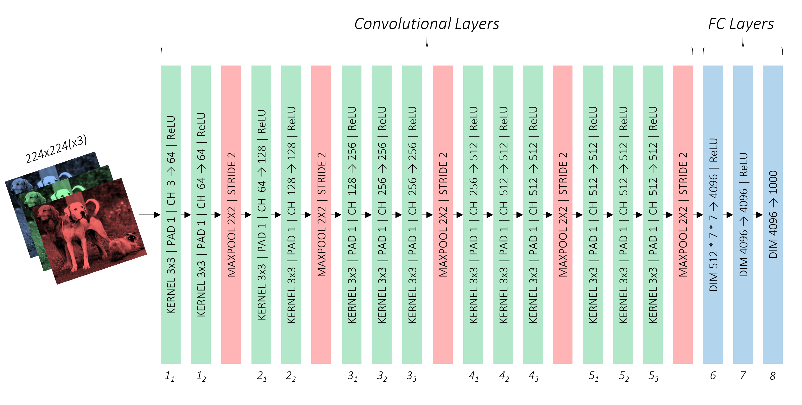

This is a **[PyTorch](https://pytorch.org) Tutorial to Class-Incremental Learning**.

Basic knowledge of PyTorch, convolutional neural networks is assumed.

If you're new to PyTorch, first read [Deep Learning with PyTorch: A 60 Minute Blitz](https://pytorch.org/tutorials/beginner/deep_learning_60min_blitz.html) and [Learning PyTorch with Examples](https://pytorch.org/tutorials/beginner/pytorch_with_examples.html).

Questions, suggestions, or corrections can be posted as issues.

I'm using `PyTorch 1.11.0+cu113` in `Python 3.9`.

Note: We recommond you install [mathjax-plugin-for-github](https://chrome.google.com/webstore/search/mathjax) read the following math formulas or clone this repository to read locally. Here is a pdf version [README.pdf](README.pdf)

**key words:** `Class-Incremental Learning`, `PyTorch Distributed Training`

---

# Contents

[***Objective***](#Objective)

[***Toolbox***](#Toolbox)

[***Concepts***](#Concepts)

[***Overview***](#Overview)

[***Implementation***](#Implementation)

[***Contact***](#Contact)

[***Acknowledgments***](#Acknowledgments)

# Objective

**To build a model that can learn novel classes while maintaining discrimination ability for old categories.**


We will be implementing the [Maintaining Discrimination and Fairness in Class Incremental Learning (WA)](https://arxiv.org/abs/1512.02325), a strong fundamental baseline of class-incremental learning methods. 

Our implementation is very efficient and straightforward to understand.  Utilizing relevant open source tools such as [torch.distributed](https://pytorch.org/tutorials/beginner/dist_overview.html), [timm](https://github.com/rwightman/pytorch-image-models), [continuum](https://github.com/Continvvm/continuum), etc., we keep the core code within 100 lines.  We believe that both beginners and researchers in related fields can gain some inspiration from this tutorial.

We also provide an introduction (in Chinese) about CIL. It is also available [here](https://zhuanlan.zhihu.com/p/490308909).

Here are some images in traditional benchmarks.

 <p align="center">
     ImageNet

</p>


 <p align="center">
     CUB

</p>

 <p align="center">
     CIFAR

</p>


# Toolbox

Now there are many excellent implementations of incremental learning methods.

[PyCIL: A Python Toolbox for Class-Incremental Learning](https://github.com/G-U-N/PyCIL)

<div align="center">

</div>
PyCIL mainly focuses on Class-incremental learning. It contains implementations of a number of founding works of CIL, such as EWC and iCaRL. It also provides current state-of-the-art algorithms that can be used for conducting novel fundamental research.  

We **strongly recommend** you refer to methods reproduced in [PyCIL](https://github.com/G-U-N/PyCIL) as the basis of your Class-Incremental Learning research.

[FACIL](https://github.com/mmasana/FACIL) 

Framework for Analysis of Class-Incremental Learning with 12 state-of-the-art methods and three baselines.

[Avalanche](https://github.com/ContinualAI/avalanche)

Avalanche contains various paradigms of incremental learning and is one of the earliest incremental learning toolkits.

# Concepts

* **Online Machine Learning**. Online machine learning is a machine learning method in which data becomes available in a sequential order and is used to update the best predictor for future data at each step, as opposed to batch learning techniques which generate the best predictor by learning on the entire training data set at once.
* **Class-Incremental Learning (CIL)**. duh.
* **Catastrophic Interference/Forgetting**. Catastrophic interference, also known as catastrophic forgetting, is the tendency of an [artificial neural network](https://en.wikipedia.org/wiki/Artificial_neural_network) to completely and abruptly forget previously learned information upon learning new information. 
* **Exemplars/Replay Buffer**.  `Replay Buffer` is commonly used in Deep Reinforcement Learning (DRL).  DRL algorithms, especially off-policy algorithms, use *replay buffers* to store trajectories of experience when executing a policy in an environment.  In the Scenario of CIL, we use a size-limited replay buffer to store a few representative instances of old classes for future training.  


- **Rehearsal**. Rehearsal is the process of training with exemplars.
- **Knowledge Distillation**. Knowledge distillation is the process of transferring knowledge from a teacher [model](https://en.wikipedia.org/wiki/Statistical_model) to a student model.  It was proposed in [Distilling the knowledge in a neural network](https://arxiv.org/abs/1503.02531). The original form of knowledge distillation minimizes the kl-divergence of the output probability distributions between the teacher and student models.  
- **Calibration**. After training on imbalanced datasets, models typically have a strong tendency to misclassify minority classes into majority classes.  This is unacceptable when minority classes are more important, e.g., Cancer Detection. Calibration aims to achieve a balance between minority classes and majority ones.

If you are still confused about the above concepts, don't worry, we will refer to them again and again later, and you may gradually understand them as you read.

# Overview

In this section, I will present an overview of Class-Incremental Learning and the above-mentioned methods. If you're already familiar with it, you can skip straight to the [Implementation](#Implementation) section or the commented code.

## Class-Incremental Learning

<div align="center">
    CIL-Diagram

</div>

The above figure illustrates the process of CIL.  In the first stage, the model learns classes 1, 2 and tests its performance on classes 1, 2. In the second stage, the model continues to learn categories 3 and 4, but the data of categories 1 and 2 is not available. After training, the accuracy of the model on categories 1, 2, 3, and 4 is calculated.  In the third stage, the model continues to learn categories 5 and 6, but the data of categories 1, 2, 3 and 4 is not available. After training, the accuracy of the model on categories 1, 2, 3, 4, 5, and 6 is calculated. 

## Catastrophic Forgetting

However, by simply fine-tuning the model on new training data, you may see the following phenomenon.  Although in the first task the model has learned how to discriminate pictures of dogs, after the second task the model seems to have completely forgotten about dogs. It misclassifies the dog into fish.  Therefore, we can see that although the recognition ability of the deep learning model based on vanilla SGD optimization in the closed world has reached or even exceeded humans, it completely lost its competitiveness in this dynamically changing world.

<div align="center">

</div>

The above phenomenon can be attributed to the following two main reasons:

**1. Lack of supervision in old classes**. Due to the loss of access to the data of the old class, when the model performs SGD optimization on new classes, it is likely to violate the optimization direction of old ones, thus destroying the feature representation of old classes.

**2. Imbalance of old and new classes**. The above setting can be seen as an extremely imbalanced training process where the number of old classes is zero.  The imbalance causes a strong bias for majority classes, and thus, the model will never predict an input image as a minority class.

## Replay Buffer

Replay Buffer is naive but effective. Since it lacks supervision in old classes, why not just store some instances for future training? As shown in the following figure, we store some representative instances (exemplars) for training in Stage2. 

<div align="center">

</div>

The following question is, how do we choose exemplars? For example, given a limited number of $m$, how do we choose $m$ exemplars from all the training data that can best represent the class. 

Take Gaussian distribution as an example, what we care about most is the mean of the distribution, which is the center of the class cluster.  Therefore, we hope that the deviation of the center of these $m$ exemplars from the center of all samples can be as small as possible. However, to find the best solution, we will need to compute ${n \choose m}$ possible solutions, which is intractable when $m$ is large.  Therefore, we take a greedy algorithm.  We **greedily** add new exemplars to the replay buffer to minimize the deviation of the center of the $m$ exemplars and that of the $n$ instances. That is, we first choose the one $\mathbf x_1$ that is the closest to the center from $n$ instances, and then we choose the one $x_2$ that makes the mean of $\mathbf x_1$ and $\mathbf x_2$ closest to the center.  Therefore, the computation complexity  is reduced to $\sum_{k=1}^{m}(n-k+1)=\frac{(2n-m+1)m}{2}=O(nm)$。

<div align="center">

</div>

## Knowledge Distillation

Although we have selected some exemplars to increase the supervision information for the old class, when the number of optional exemplars, i.e., $m$, is very small, we still can only get very little supervision information for the old classes. Hence, we need additional supervision information to help the model better maintain the representational ability of the old classes. 

**Knowledge Distillation** is a good idea. A real-life example, in East Asia, parents are willing to spend very high educational funds to hire excellent teachers to teach their children. Because they believe that with a good teacher, children can get good grades with less effort. That is also the truth in deep neural networks. A student model can achieve better performance by employing the soft supervision provided by the teacher model.

$$
\mathcal{L}_{KD}(\mathbf{x})=\sum_{c=1}^{C}-\hat{q}_{c}(\mathbf{x}) \log \left(q_{c}(\mathbf{x})\right),
$$

where $\hat{q}_{c}(\mathbf{x})=\frac{e^{\hat{o}_{c}(\mathbf{x}) / T}}{\sum_{j=1}^{C} e^{\hat{o}_{j}(\mathbf{x}) / T}}$ is the Softmax of the logits divided by the temperature $T$ of the teacher model, and $q_c(\mathbf x)$ is that of the student model. Some beginners might feel confused about the knowledge distillation form and why we sometimes call the above cross-entropy kl-divergence equivalently. Here we provide a brief explanation in a formula. Think why the following equation is correct.

$$
\begin{align}
\min_{\theta} &\quad\mathrm{KL}\left(\hat{q}_{c}(\mathbf{x}\mid \hat\theta)\mid q_{c}(\mathbf{x}\mid \theta)\right)\\
=\min_{\theta}&\quad \sum_{c=1}^{C}\left\{\hat{q}_{c}(\mathbf{x}\mid \hat{\theta}) \log \left(\hat{q}_{c}(\mathbf{x} \mid \hat{\theta})\right)-\hat{q}_{c}(\mathbf{x}\mid \hat{\theta}) \log \left(q_{c}(\mathbf{x}\mid \theta)\right)\right\}\\
=\min_\theta &\quad \sum_{c=1}^{C}-\hat{q}_{c}(\mathbf{x}\mid \hat{\theta}) \log \left(q_{c}(\mathbf{x})\mid \theta\right).
\end{align}
$$

So, where do we find the teacher?

The model itself in the previous phase is a good teacher! We restore the model in the previous phase to provide more supervision of old classes. 

<div align="center">

</div>

Therefore, the overall loss combines $\mathcal L_{CE}$ and $\mathcal L_{KD}$
$$
\mathcal{L}(\mathbf{x}, y)=(1-\lambda) \mathcal{L}_{C E}(\mathbf{x}, y)+\lambda \mathcal{L}_{K D}(\mathbf{x}),
$$

where $\lambda$ is set to a default value or dynamically set to $\frac{n}{n
+m}$.

## Weight Alignment

Here, to give an explanation of how weight alignment is achieved and why it works, we decouple the classification model into a feature extractor $\phi(\mathbf x)$and a linear classifier $W$ (ignoring bias $\boldsymbol b$).

We take VGG16 as an example.  

 <div align="center">

</div>

Although deep neural networks can be designed as various architectures,  most of them can be decoupled as follows. The whole network excluding the final FC layer can be viewed as a feature extractor. It transforms the input image into a hidden feature space where most classes are linearly separable.

 <div align="center">

</div>

 The Classifier $W$ transforms these features into logits, namely
$$
\mathbf o= W \phi(\mathbf x),
$$
where $\mathbf o$ is the logits (output of the model).

Ignoring the bias, the classifier $W$ is essentially a matrix that represents a linear transform from feature space $\mathbb R^{d}$ to logits space $\mathbb R^{n+m}$, where $d$ is the dimension of the feature space; $n$ is the number of old categories; and $m$ is the number of new categories.  The matrix can be further decomposed into a list of vectors $w_1,w_2,\dots,w_n,w_{n+1},\dots,w_{n+m}$.  We call them prototypes. 

 <div align="center">

</div>
Thus the output logits $\mathbf o$
$$
\mathbf o = W\phi(\mathbf x) =\left(\begin{array}{c} W_{old}^T\phi(\mathbf x) \\ W_{new}^T \phi(\mathbf x)\end{array}\right) = \left(\begin{array}{c} w_1^T \phi(\mathbf x) \\ w_2^T \phi(\mathbf x)\\\vdots \\ w_n^T \phi(\mathbf x) \\ w_{n+1}^T \phi(\mathbf x) \\ \vdots \\w_{n+m}^T \phi(\mathbf x) \end{array}\right)
$$
From the above decomposition, it is apparent that the absolute logit of the $i$-th class is proportional to the norm of vector $w_i$. Nowadays, state-of-the-art model architectures use ReLU ($\mathrm {ReLU}(x)=\max (x)$)  as the non-linear activation,  leading to models tending to have non-negative hidden features and outputs.  As a result, **it is typical to find that classes with larger norm values of $w$ tend to have larger logits.**


Extensive experiments show that the norms of new class prototypes are usually much larger than those of old ones. Therefore, the norms difference between old and new prototypes causes a strong classification bias to new classes, destroying all classes' calibration and overall performance.

 <div align="center">

</div>

Based on the above analysis, a trivial but effective calibration method is to let new and old prototypes have the same average norm.

We first calculate the ratio factor of the norms of the old and new classes
$$
\gamma=\frac{\operatorname{Mean}\left(\text { Norm }_{\text {old }}\right)}{\operatorname{Mean}\left(\text { Norm }_{n e w}\right)},
$$
and then we multiply the ratio factor with the new prototypes
$$
\hat{W}_{new}=\gamma W_{new}.
$$
 After that the correct logits are
$$
\mathbf o_{correct} =\left(\begin{array}{c} W_{old}^T\phi(\mathbf x) \\ \gamma W_{new}^T \phi(\mathbf x)\end{array}\right) = \left(\begin{array}{c} w_1^T \phi(\mathbf x) \\ w_2^T \phi(\mathbf x)\\\vdots \\ w_n^T \phi(\mathbf x) \\ \gamma w_{n+1}^T \phi(\mathbf x) \\ \vdots \\\gamma w_{n+m}^T \phi(\mathbf x) \end{array}\right).
$$
Then we finished the whole training phase.

# Implementation

The sections below briefly describe the implementation.

They are meant to provide some context, but **details are best understood directly from the code**, which is quite heavily commented.

### Dataset

We will use CIFAR100 and ImageNet-100/1000, which are common benchmarks in Class-Incremental Learning. 

#### Download

For CIFAR-100, the python scripts will automatically download it. We recommend you test the code with CIFAR-100 since it takes much less computation overhead compared to ImageNet.

While for ImageNet-100/1000, you should download the dataset from [Image-net.org](https://image-net.org/) and specify the [DATA_PATH] in the code.

### Data pipeline

#### Continuum Class-Incremental Scenario

See `build_dataset` in [`utils.py`](utils.py).

```python
from continuum import ClassIncremental
scenario = ClassIncremental(
        dataset,
        initial_increment=args.num_bases,
        increment=args.increment,
        transformations=transform.transforms,
        class_order=args.class_order
)
```

By utilizing the Class  `ClassIncremental`provided by continuum, we can easily generate the required dataset at any stage.

There are five arguments we are required to specify

- **dataset**. A PyTorch style dataset (CIFAR100) or a ImageFolder style dataset (ImageNet).
- **initial_increment**. The number of classes in the $0$-th phase.
- **Increment**. The number of classes in the following phases.
- **class_order**. The order of all the classes. For CIFAR100, it is a permutation of 1, 2, 3,..., 100.

#### Data Transforms

See `build_transform()` in [`utils.py`](utils.py).

```python
from timm.data import create_transform
transform = create_transform(
 input_size=args.input_size,
 is_training=True,
 color_jitter=args.color_jitter,
 auto_augment=args.aa,
 interpolation='bicubic',
 re_prob=args.reprob,
 re_mode=args.remode,
 re_count=args.recount,
)
```

 `create_transform` in timm provides a strong baseline augmentation method.

#### PyTorch Sampler and DataLoader

Using the distributed training framework that PyTorch has officially implemented, we only need to pass in a DistributedSampler for the DataLoader. The Sampler automatically allocates data resources to each process, speeding up training.

```python
train_sampler = DistributedSampler(
            dataset_train, num_replicas=args.world_size, rank=args.rank, shuffle=True)

val_sampler = DistributedSampler(
            dataset_val, num_replicas=args.world_size, rank=args.rank, shuffle=False)
    
train_loader = DataLoader(
    dataset_train, batch_size=args.batch_size, sampler=train_sampler, num_workers=10, pin_memory=True)
        
val_loader = DataLoader(
            dataset_val, batch_size=args.batch_size, sampler=val_sampler, num_workers=10)

for epoch in range(args.num_epochs):
    sampler.set_epoch(epoch)

```

For each epoch, we pass in a new epoch for the sampler to shuffle the order in which the data appears.

For more complex data collection methods, we need to **pass a collating function to the `collate_fn` argument**, which instructs the `DataLoader` about how it should combine these varying size tensors. The simplest option would be to use Python lists.

### Feature Extractor

See `CIFAR-ResNet` in [`resnet.py`](resnet.py).

We use the python code in [PyCIL](https://github.com/G-U-N/PyCIL/blob/master/convs/cifar_resnet.py).

### CilClassifier

See `CilClassifier` in [`template.py`](template.py).

CilClassifier is a dynamically scalable linear classifier specially designed for CIL. It is cleverly designed and easy to understand.

At the beginning of a new task, instead of dropping the old classifier and generating a new one, it adds a new small classifier and concatenates it with the original classifier.

### CilModel

See `CilMolde`in [`template.py`](template.py).

As we discussed above, the CilModel consists of two parts

- **feature extractor** (we call it backbone in the code)
- **Classifier** (we use CilClassifier to support the dynamic expansion)

And in order to achieve weight alignment and save the teacher model, we also implemented some functions such as parameter freezing and copying, and model expansion.

# Training

To **train your model from scratch**, run this file –

```bash
CUDA_VISIBLE_DEVICES=0,1,2,3 torchrun --nproc_per_node=4 template.py 
```

### Remarks

In my implementation, I use **Stochastic Gradient Descent** in batches of `128` images, with an initial learning rate of `1e−1`, momentum of `0.9`, and `5e-4` weight decay. We set the number of epochs to 170 and use the CosineAnnealingLR with T_max=170. Some of the hyperparameters are inconsistent with the implementation of the original paper, but it does not affect much on the performance.

With 4 RTX 3090 distributed training, the experiments on CIFAR-100 with base 50 and increment 10 end in 30 minutes.

# Contact

If there are any questions, please feel free to propose new features by opening an issue or contact with the author: **Fu-Yun Wang** ([wangfuyun@smail.nju.edu.cn](mailto:wangfuyun@smail.nju.edu.cn)). Enjoy the code.

> Note: This repository is still under development. Interested researchers are welcome to contribute improvements to the code and tutorials

# Acknowledgments

We thank the following repos for providing helpful components/functions in our work.

[PyCIL](https://github.com/G-U-N/PyCIL)

[DyTox](https://github.com/arthurdouillard/dytox)


**End.**

 <div align="center">

</div>
